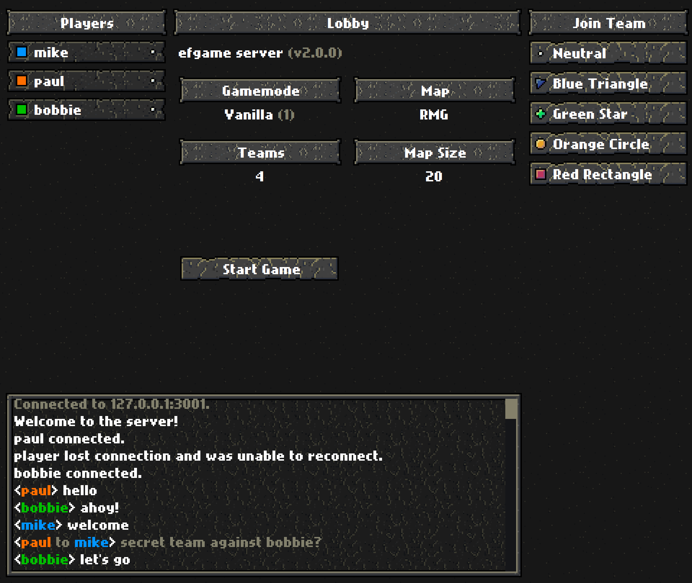

# EFGAME
This is a turn-based multiplater strategy game written in javascript (message me if you'd like to play a match).
Wrote this in the summer of 2018.
Attempted to update in 2020-2021.
Fully rewrote in Dec 2023.
Consists of: Client and Server

Idea taken from http://www.enemyflag.net/ (which is a lovely game, big thanks to Bartłomiej Baron).

### Setup
```bash
cd common
yarn install
```

## Client
Built with react, runs in your browser.
```bash
cd client
yarn install
yarn start
```

## Server
Built with `ts-node`, runs on a computer.
```bash
cd server
yarn install
yarn start
```

## Gallery





