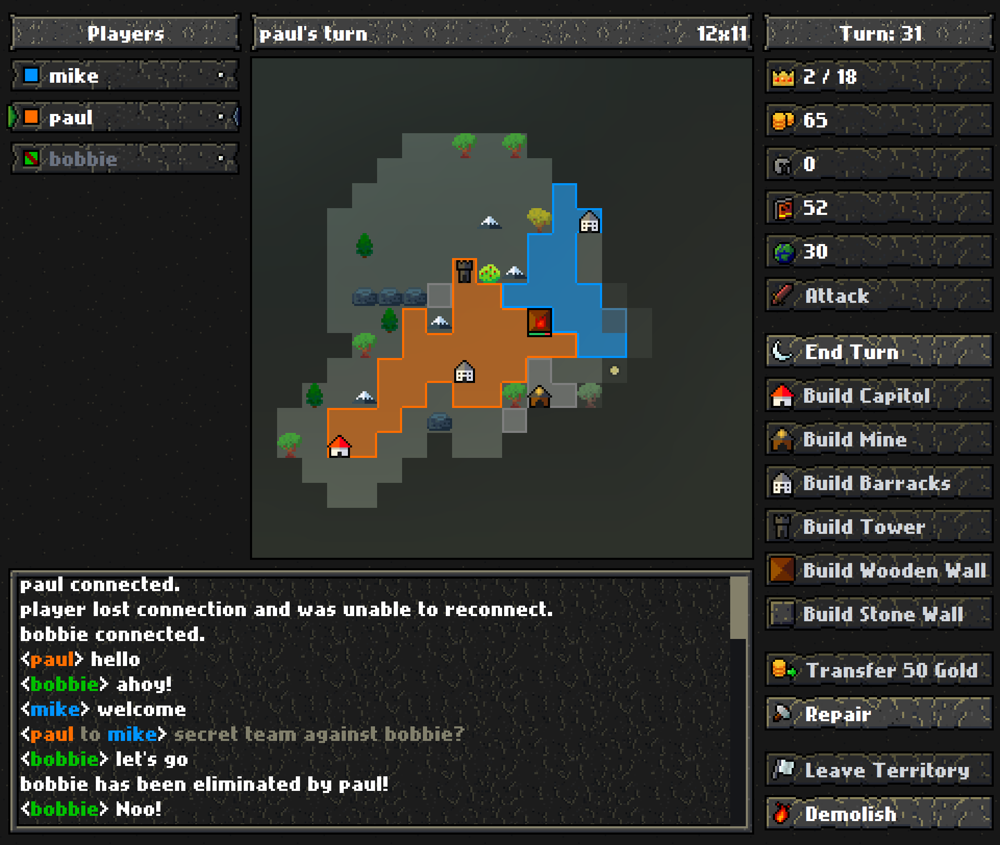
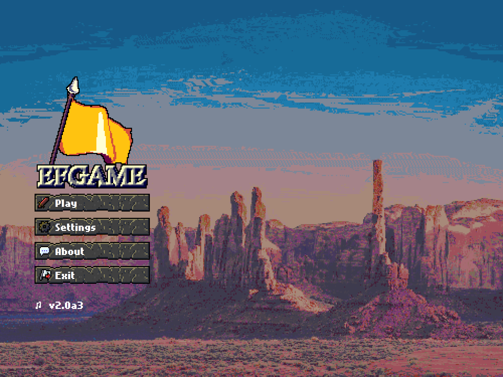
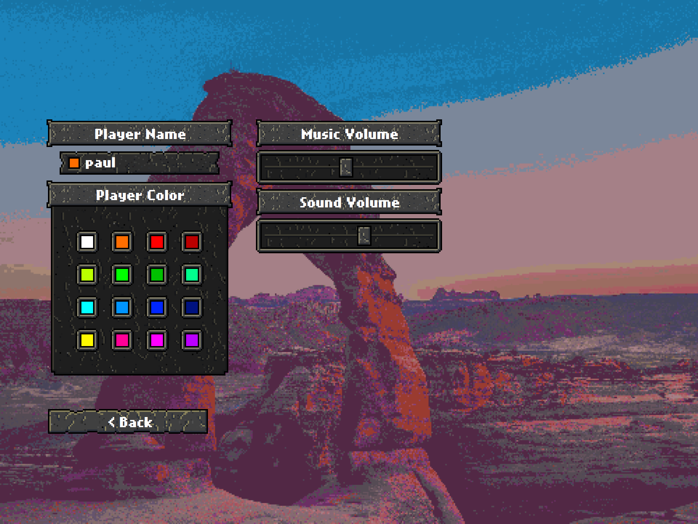

# EFGAME
A turn-based multiplater strategy game written in javascript.
Initial version written in the summer of 2018.
Tried to update in 2020-2021.
Hopefully new client update in 2023.

Contains a Client and Server program.

Idea from http://www.enemyflag.net/ (which is a lovely game, message me if you'd like to play a match).
Functionallity added: customizable play area (not locked to 20x20)

### Client
HTML & JS, runs with Electron.

### Server
JS, networking with socket.io.

## Future plans
* Web client

# Gallery

